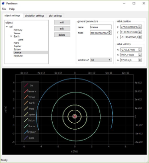

__Note:__ unfortunatley a binary can currently not be provided due to a [bug](https://github.com/pyinstaller/pyinstaller/issues/2426) in pyinstaller.

# Pantheon
Pantheon is an orbital mechanics simulation tool with an easy to use user interface. It allows to quickly verify the stability of systems of celestial bodies (e.g. stars, planets and moons) over extend time periods. With the integrated plotting capability simulation results can be visualized and studied without the need for any external software.

### How to use Pantheon?
1) In the _object settings_ tab an objects name, mass, initial position, and velocity are defined. If at least one other object has previously been added a primary, i.e. a reference object to which position and velocity will be relative to, can also be selected. 
By pressing the __add__ button the object is registered and will be displayed in the object tree on the left.
A sample file containing the sun and its eight planets can also be loaded via _File -> Load -> example_objects_sol.dat_
2) In the _simulation settings_ the time step, total time, and number of time steps for the simulation can be defined. The default is a total of 365 time steps of a day each. If memory or (plot) performance become an issue, there is also the option to only keep every nth (with n selectable by the user; default is 1) time step in the final result. If desired, the simulation can also be executed on the GPU via OpenCL. Lastly, the numerical algorithm can be changed here.
By pressing the __run simulation__ button the simulation is started.
3) The _plot settings_ tab allows to choose the plot plane (XY, XZ, YZ), as well as rearrange the simulation results to be plotted relative to the motion of any of the simulated objects. This is often necessary for simulations over longer periods of time as the system as a whole will frequently drift with respect to the lab frame, caused by the nonvanishing total momentum of the system. In such cases choosing the central object (e.g. the main star) as the new plot origin will fix the issue.
At any point the plot can be set to the desired parameters by pressing the __update plot__ button.

### FAQs
+ _What algorithm is Pantheon using?_
Pantheon offers a chocie of two algorithms:
    1) a simple, but fast first order [leap-frog alogrithm](https://en.wikipedia.org/wiki/Leapfrog_integration),
    2) and the much more accurate but slower [Position Extended Forest-Ruth Like](https://arxiv.org/abs/cond-mat/0110585) algorithm.

    Both algorithms are symplectic and have the _big_ advantage that numerical errors typically do not accumulating over time. As a consequence ssymplectic integration schemes are well suited for simulations ofer extended periods of time and where inherent system stablity is to be maintained.
+ _How fast is Pantheon?_
Time is relative. The time required to perform any given simulation depends very much on the complexity of the system, the number of time steps, the algorithm, and of course machine specs. That being said, for simple systems such as our sun and its eight planets a period of a thousand years is calculated within few minutes or less. It should be kept in mind though that Pantheon's simulation code is hardly optimized and that if speed as of utmost importance, a more professional set of tools is what you are looking for - likely at the expense of the accessibility provided by Pantheon.
+ _My orbits look more like a Spirograph pattern than the ellipses I was expecting. What am I doing wrong?_
Most likely your time step is set too large. Half its value and see if that solves the issue. Repeat if necessary. Alternatively you may choose the more accurate (but slower) PEFRL algorithm.
+ _My system remains stable for some time until suddenly one of the objects is catapulted out of the system. What is going on?_
The issue is likely to be caused by a time step not small enough to accuratley simulate the system during a close encounter between two objects. Again, reducing the time step should solve the issue. 
+ _How can I export the simulation results?_
To export any calculations results (images or raw data) right-click on the plot area and choose _Export..._
+ _Did you consider extending your simulation code to account for [insert feature]?_
Pantehon's simulation code is indeed very simplistic and the implementation naive at times. However, Pantheon was never intended to be a full orbital mechanics suite but rather is intended to provide an acessible playground to test small scale systems in. That is not to say that more simulation features are not possible in future versions, however, they are currently not a priority.

---
### Source dependencies
Pantheon is built on Python 3 as well the following libraries:
+ [PyQt5](https://www.riverbankcomputing.com/software/pyqt/download5) for the UI as well as some other features
+ [PyQtGraph](http://www.pyqtgraph.org) for the interactive plot of the simulation results
  + __Note:__ For Qt5 compatibility the current [development version](https://github.com/pyqtgraph/pyqtgraph) rather than the latest official release (0.10.0) has to be used. However, as of March 2017 PyQtGraph's custom SpinBox class which is used in Pantheon appears to be broken in the development version. This can be remedied by falling back on the latest official version of this file instead.
+ [PyOpenCL](https://mathema.tician.de/software/pyopencl/) to allow hardware accelerated computations on the GPU
+ [NumPy](http://www.numpy.org) for fast linear algebra functionalities
